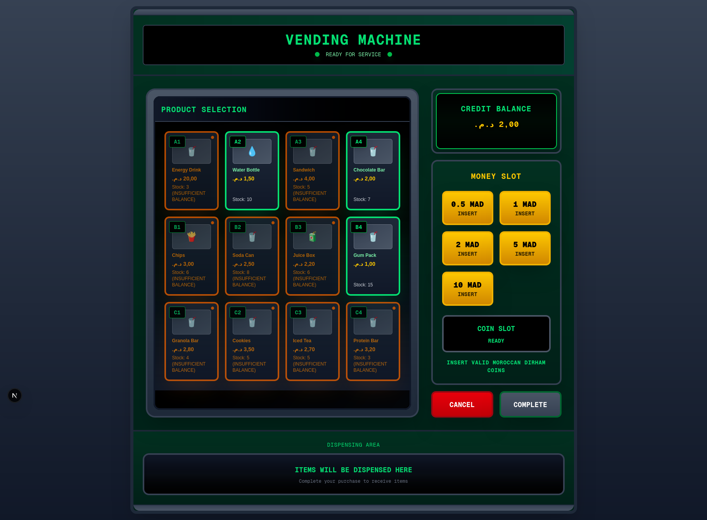
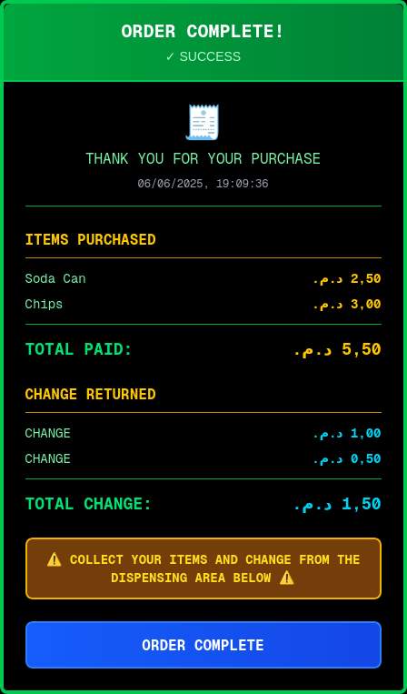

# Distributeur Automatique - Frontend


Application frontend pour un système de distributeur automatique développée avec Next.js et TypeScript. Cette application offre une expérience utilisateur intuitive et interactive simulant l’utilisation d’un vrai distributeur automatique.

## Présentation

Cette interface frontend sert d’interface client pour le système de distributeur automatique, permettant aux utilisateurs de :

* Insérer de l’argent en Dirhams marocains (MAD)
* Parcourir et sélectionner des produits via une grille dynamique
* Suivre en temps réel le solde et les détails de la transaction
* Finaliser les achats et recevoir des reçus numériques
* Annuler les transactions et récupérer l’argent inséré

## Fonctionnalités

### Fonctionnalités principales

* **Gestion de l’argent :** Prise en charge des coupures MAD 0,5, 1, 2, 5 et 10
* **Sélection de produits :** Grille interactive avec affichage du stock en temps réel
* **Traitement des transactions :** Cycle complet de la transaction, de l’insertion d’argent à la délivrance du produit
* **Suivi du solde :** Calcul dynamique du solde restant après sélection des produits
* **Génération de reçus :** Reçus numériques résumant les achats et la monnaie rendue

### Expérience utilisateur

* **Design authentique :** Apparence réaliste de distributeur automatique pour une interaction immersive

### Aspects techniques

* **Intégration backend :** Communication via API REST pour toutes les opérations
* **Gestion d’état :** Gestion robuste des flux complexes de transaction avec React
* **Sécurité de typage :** Développement intégral en TypeScript pour plus de fiabilité et de maintenabilité

## Technologie utilisée

* **Framework :** Next.js 15.3.3
* **Langage :** TypeScript
* **Style :** Tailwind CSS
* **Gestionnaire de paquets :** npm

## Captures d’écran

### État initial — Aucun argent inséré


Les produits sont visibles mais désactivés, incitant l’utilisateur à insérer de l’argent pour commencer.

### Argent inséré — Produits disponibles


Les produits deviennent interactifs selon l’argent inséré. Les bordures vertes indiquent les produits abordables, les bordures orange ceux nécessitant plus de fonds.

### Sélection de produits


Les produits sélectionnés sont mis en évidence par des bordures jaunes et des coches. Le panneau de transaction affiche le solde actuel, les articles sélectionnés et le coût total.

### Reçu de transaction

 
Reçu numérique affiché après une transaction réussie, détaillant les articles achetés, le paiement et la monnaie rendue.

## Utilisation

### Développement

Lancer le serveur de développement :

```bash
npm run dev
```

L’application sera accessible sur `http://localhost:3000`.

### Tests

Lancer les tests :

```bash
npm test
```

Lancer les tests avec rapport de couverture :

```bash
npm run test:coverage
```

## Intégration API

Le frontend communique avec l’API backend pour toutes les opérations :

* `GET /api/products` — Récupérer la liste des produits disponibles
* `POST /api/transaction/money` — Insérer de l’argent
* `GET /api/transaction/money` — Obtenir le total d’argent inséré
* `POST /api/transaction/products/select/{id}` — Sélectionner un produit
* `GET /api/transaction/products/selected` — Obtenir les produits sélectionnés
* `POST /api/transaction/products/unselect/{id}` — Désélectionner un produit
* `POST /api/transaction/complete` — Finaliser la transaction
* `POST /api/transaction/cancel` — Annuler la transaction

## Configuration

### Devises supportées

Prise en charge des coupures en Dirhams marocains (MAD) :

* 0,5 MAD
* 1 MAD
* 2 MAD
* 5 MAD
* 10 MAD

## Architecture

### Vue d’ensemble des composants

* **VendingMachine :** Conteneur principal gérant l’état global et la logique
* **ProductGrid :** Affiche les produits et gère la sélection/désélection
* **TransactionPanel :** Gère l’insertion d’argent, l’affichage du solde et les contrôles de transaction (confirmation, annulation)
* **MoneyInput :** Interface d’insertion des coupures
* **Receipt :** Affiche le résumé détaillé de la transaction après finalisation

### Gestion d’état

L’application utilise la gestion d’état native de React pour maintenir :

* L’inventaire et la disponibilité des produits
* L’état actuel de la transaction, y compris les produits sélectionnés
* L’argent inséré et le calcul du solde restant
* Les états de chargement et de gestion des erreurs