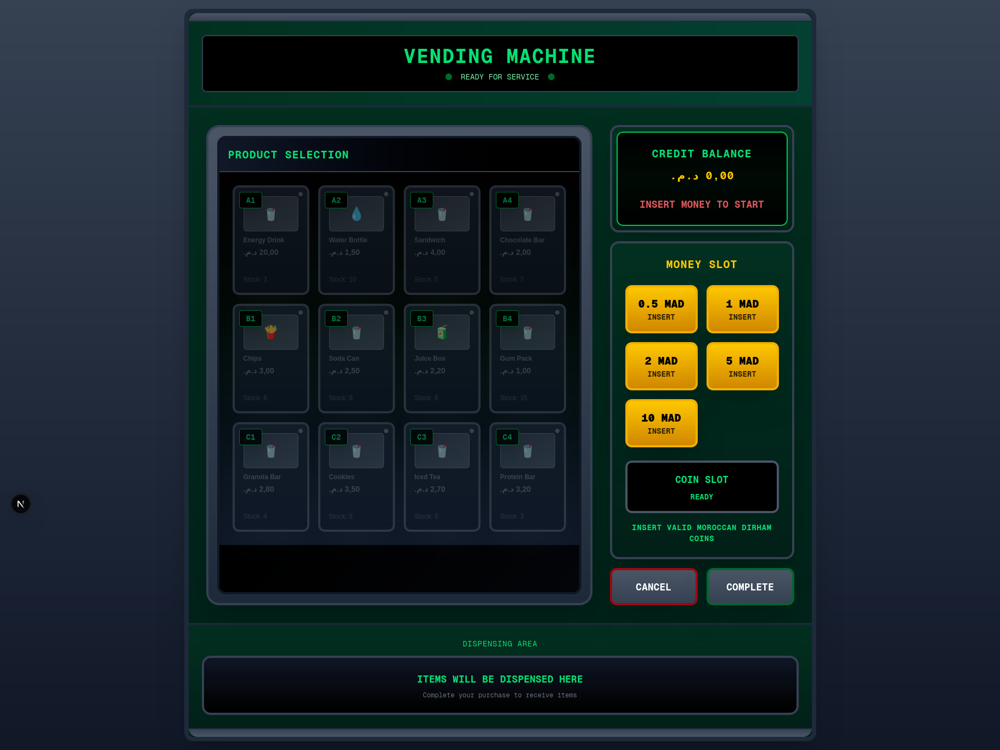
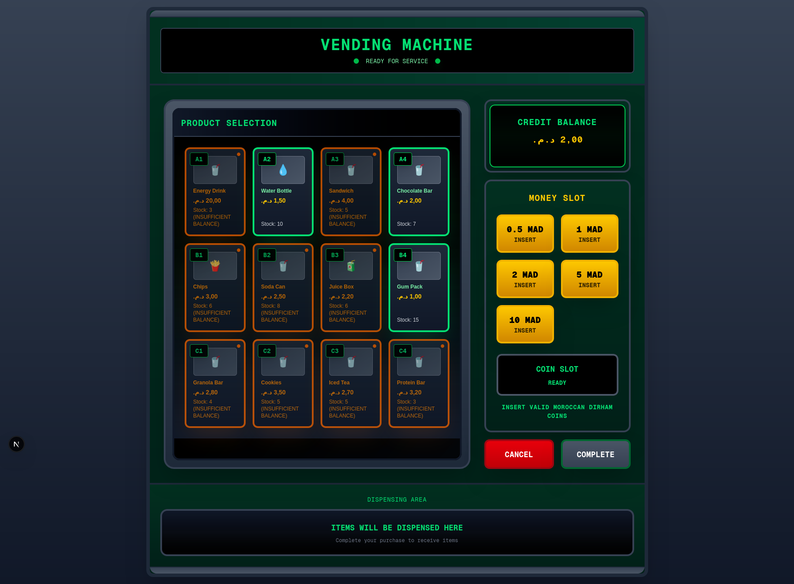
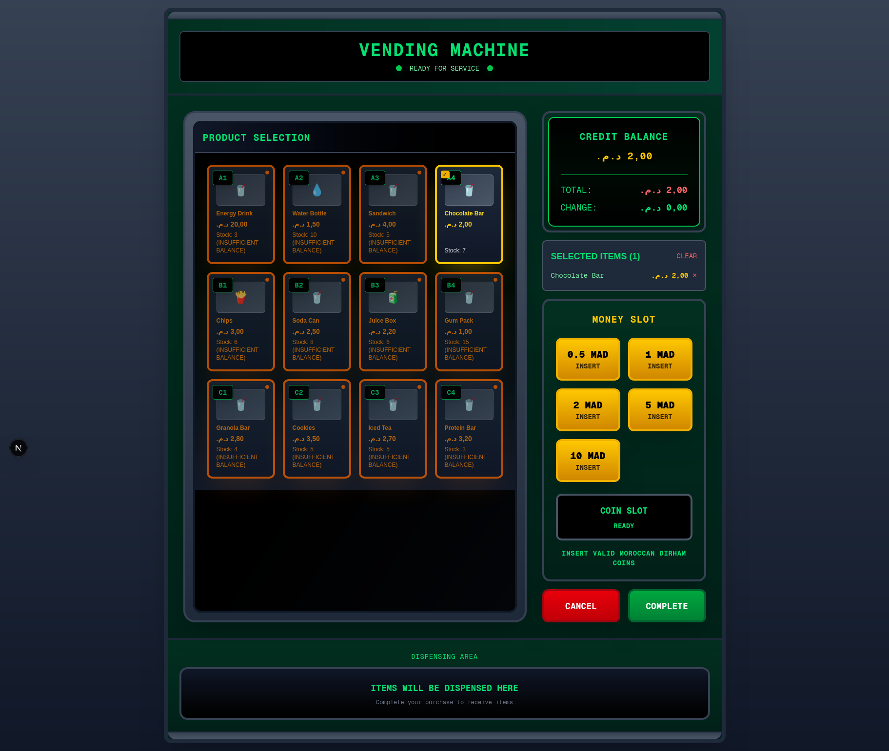
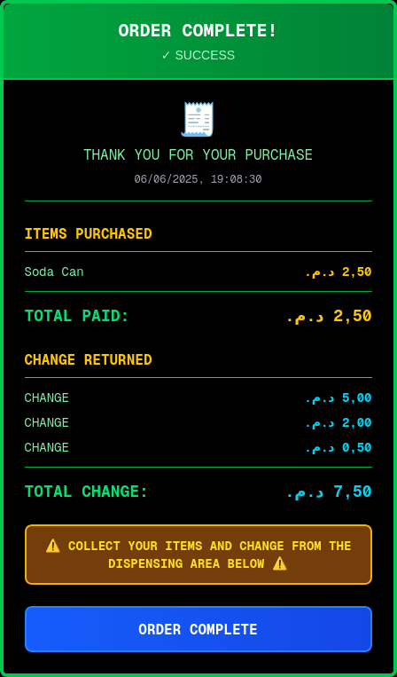
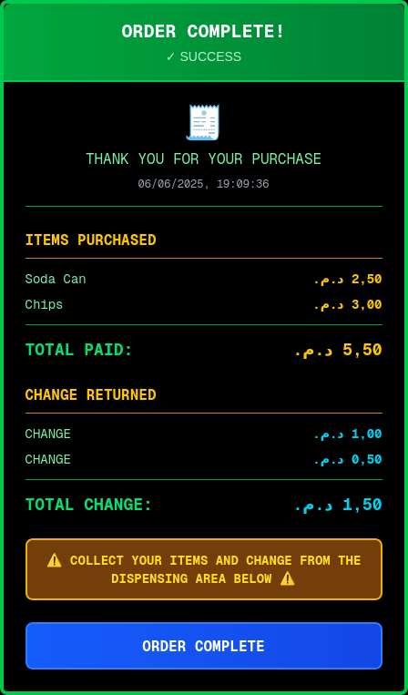

# Vending Machine Frontend

A modern, responsive frontend application for a digital vending machine system built with Next.js and TypeScript. This application provides an intuitive user interface that simulates the experience of using a real vending machine.

## Overview

This frontend application serves as the user interface for a vending machine system, allowing customers to:
- Insert money using various Moroccan Dirham denominations
- Browse and select products from an interactive product grid
- View real-time balance and transaction information
- Complete purchases and receive digital receipts
- Cancel transactions and receive refunds

## Features

### Core Functionality
- **Money Management**: Support for MAD 0.5, 1, 2, 5, and 10 denominations
- **Product Selection**: Interactive grid displaying available products with real-time stock information
- **Transaction Processing**: Complete transaction lifecycle from money insertion to product dispensing
- **Balance Tracking**: Real-time remaining balance calculation after product selections
- **Receipt Generation**: Digital receipts with transaction details and change information

### User Experience
- **Realistic Design**: Authentic vending machine appearance with professional styling
- **Responsive Layout**: Optimized for various screen sizes and devices
- **Real-time Updates**: Live synchronization with backend for accurate state management
- **Error Handling**: Comprehensive error messages and user guidance
- **Accessibility**: Clear visual feedback and intuitive navigation

### Technical Features
- **Backend Integration**: RESTful API communication for all operations
- **State Management**: Robust state handling for complex transaction flows
- **Type Safety**: Full TypeScript implementation for enhanced reliability
- **Performance**: Optimized rendering and efficient data fetching

## Technology Stack

- **Framework**: Next.js 15.3.3
- **Language**: TypeScript
- **Styling**: Tailwind CSS
- **Package Manager**: npm

## Screenshots

### Initial State - No Money Inserted


The initial state of the vending machine when no money has been inserted. Products are visible but disabled, and the system prompts users to insert money to begin.

### Money Inserted - Products Available


After inserting money, products become interactive based on the remaining balance. Green borders indicate affordable products, while orange borders show products that require additional funds.

### Product Selection


Selected products are highlighted with yellow borders and checkmarks. The transaction panel shows the current balance, selected items, and total cost.

### Transaction Receipt
 

Digital receipt displayed after successful transaction completion, showing purchased items, payment details, and change information.


## Usage

### Development
Start the development server:
```bash
npm run dev
```

The application will be available at `http://localhost:3000`.

### Production
Build and start the production server:
```bash
npm run build
npm start
```

### Testing
Run the test suite:
```bash
npm test
```

Run tests with coverage:
```bash
npm run test:coverage
```

## API Integration

The frontend communicates with a backend API for all operations:

- **GET /api/products** - Retrieve available products
- **POST /api/transaction/money** - Insert money
- **GET /api/transaction/money** - Get inserted money amount
- **POST /api/products/{id}** - Select a product
- **GET /api/transaction/products/selected** - Get selected products
- **GET /api/transaction/products/unselect/{id}** - Unselect a product
- **POST /api/transaction/complete** - Complete transaction
- **POST /api/transaction/cancel** - Cancel transaction

## Configuration

### Supported Currencies
The application supports Moroccan Dirham (MAD) with the following denominations:
- 0.5 MAD
- 1 MAD
- 2 MAD
- 5 MAD
- 10 MAD

## Architecture

### Component Structure
- **VendingMachine**: Main container component managing application state
- **ProductGrid**: Interactive product display with selection capabilities
- **TransactionPanel**: Money insertion, balance display, and transaction controls
- **MoneyInput**: Currency denomination input interface
- **Receipt**: Transaction completion and receipt display

### State Management
The application uses React's built-in state management with a centralized state structure:
- Product inventory and availability
- Transaction state and selected items
- Money insertion and balance tracking
- Loading states and error handling